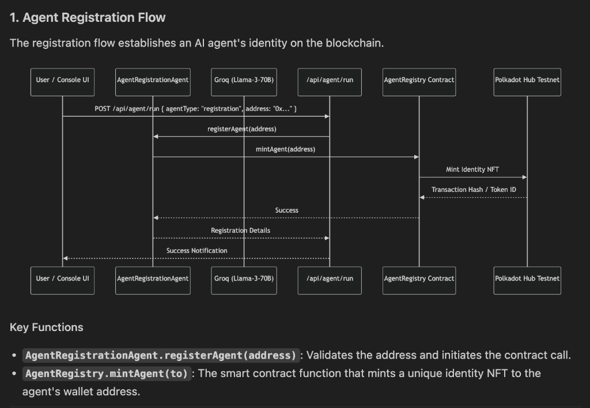
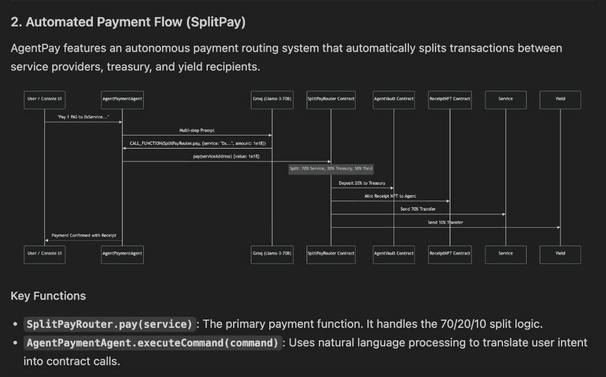

# 🤖 AgentPay: Autonomous Financial Protocol

AgentPay is a premium, high-performance interface for autonomous financial agents. It enables seamless interactions between AI agents and decentralized finance (DeFi) protocols, featuring cross-chain routing, vault management, and real-time protocol monitoring.

---

## 🌐 Live Application
Access the platform here: **[a-gentpay.vercel.app](https://a-gentpay.vercel.app/)**

---

## 🚀 Key Features

*   **Control Center Dashboard**: A futuristic mission control for your financial agents. Monitor network health, latency, and block height in real-time.
*   **Autonomous Agent Console**: An advanced interface where you can talk to specialized AI agents for **Payments**, **Registration**, and **Treasury Management**.
*   **Chain Proof Verification**: Every action is verified on-chain. Get direct links to transaction proofs on the **Polkadot Hub Hub** explorer.
*   **Premium UI/UX**: A dark-mode, glassmorphic design built for professionals, featuring smooth animations and high-fidelity components.

---

## 🔄 How It Works: The Flow

AgentPay bridges the gap between natural language intent and blockchain execution.

### 1. Agent Identity (Registration)
To participate in the ecosystem, an agent must first be registered. The **Registration Agent** mints a unique Identity NFT to the agent's wallet. This NFT acts as a "passport" within the protocol.

### 2. Autonomous Payments (SplitPay)
When you tell an agent to "Pay 1 PAS to service X," the following happens:
*   **Understanding**: The AI parses your request using Llama-3.
*   **Execution**: It calls the **SplitPayRouter** contract.
*   **The Split**: The protocol automatically routes the funds:
    *   **70%** goes to the Service Provider.
    *   **20%** goes to the Protocol Treasury (AgentVault).
    *   **10%** goes to Yield rewards.
*   **Proof**: You receive a **Receipt NFT** automatically as proof of payment.

### 3. Treasury & Vaults
The **Treasury Agent** manages assets stored in the **AgentVault**, allowing for secure deposits, withdrawals, and balance tracking of protocol-controlled funds.

---

## 📜 Deployed Smart Contracts (Polkadot Hub Hub)

The protocol is currently deployed on the **Polkadot Hub** testnet.

| Contract | Address |
| :--- | :--- |
| **Wrapped Native (PAS)** | `0xd3215799fB97296853BC07203c369e2611be55f3` |
| **Agent Registry** | `0xd41B3eBDC73Dc92816e7B397726A9caF09319840` |
| **Agent Vault** | `0xc9624F90c36357093AA96c689AaC423c16249C99` |
| **SplitPay Router** | `0x472e1f2F3a237Ea213D5144c945B6Cfc75190F6a` |
| **Receipt NFT** | `0xC92D970130c0F54eE24Cf81Cc4cB74925a9022d8` |

---

## 🛠 Tech Stack

- **Frontend**: Next.js 14+ with Zustand for state management.
- **Styling**: Tailwind CSS & Framer Motion for premium aesthetics.
- **AI Engine**: Groq (Llama-3-70B) for intelligent command parsing.
- **Blockchain**: Polkadot Hub (EVM-compatible) using Viem for contract interactions.

---

## 🏗 Developer Setup

1. **Install Dependencies**: `npm install`
2. **Run Dev Server**: `npm run dev`
3. **Open Terminal**: Access [http://localhost:5003](http://localhost:5003)

*Built with precision for the next generation of autonomous finance.*
